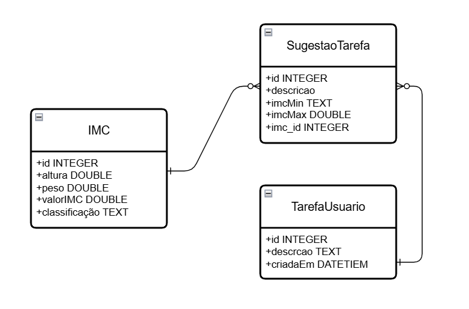

# PROJETO INTEGRADOR - ANALISE DE SOLUÇÕES INTEGRADAS PARA ORGANIZAÇÕES

<br>

##

## Contribuidores do Projeto

<table>
   <caption>Tabela de contribuição do grupo</caption>
   <thead>
      <tr>
         <th>Tarefas</th>
         <th>Contribuidor</th>
      </tr>
   </thead>
   <tbody>
      <tr>
         <td>Desenvolvimento do APP</td>
         <td>João Ricado Fortunato da Silva</td>
      </tr>
      <tr>
         <td>Modelo Entidade-Relacionamento(MER)</td>
         <td>Felipe Carreira Dos Santos</td>
      </tr>
      <tr>
         <td>Diagrama Entidade-Relacionamento(DER)</td>
         <td>Gabriel Guilherme Dos Santos Almeida</td>
      </tr>
      <tr>
         <td>Criação do Repositorio no Github</td>
         <td>João Ricado Fortunato da Silva</td>
      </tr>
      <tr>
         <td>Desenvolvimento da Landing Page</td>
         <td>João Ricado Fortunato da Silva</td>
      </tr>
      <tr>
         <td>Desenvolvimento do README</td>
         <td>João Ricado Fortunato da Silva</td>
      </tr>
      <tr>
         <td>Documentação tecnica do projeto</td>
         <td>João Ricado Fortunato da Silva</td>
      </tr>
      <tr>
         <td>Video Demostrativo do Projeto</td>
         <td>João Roberto Garske Pontes</td>
      </tr>
      <tr>
         <td></td>
         <td></td>
      </tr>
   </tbody>
</table>

<br><br>

##

## Resumo

O **IMC Tasks Manager** é um aplicativo inovador desenvolvido em Flutter, projetado para facilitar o gerenciamento de tarefas garantindo melhor controle sobre o Índice de Massa Corporal (IMC) do usuário. Com uma interface intuitiva e funcionalidades práticas, o aplicativo ajuda a organizar e acompanhar suas atividades, promovendo uma rotina mais saudável e eficiente.
<br><br>

##

## Descrição do Projeto

O **IMC Tasks Manager** é uma aplicação multiplataforma desenvolvida utilizando o framework Flutter, com o objetivo de oferecer uma solução eficiente e prática para o gerenciamento de tarefas relacionadas ao Índice de Massa Corporal (IMC). O projeto foi concebido com foco na usabilidade e na experiência do usuário, integrando funcionalidades que permitem o acompanhamento e a organização de atividades voltadas para a saúde e o bem-estar.

A arquitetura do aplicativo foi projetada para ser modular e escalável, utilizando o padrão de gerenciamento de estado nativo do Flutter para garantir uma interação fluida e responsiva. O armazenamento local é implementado com o uso do package **shared_preferences**, permitindo a persistência de dados de forma simples e eficiente, sem a necessidade de um banco de dados relacional.

Além disso, o aplicativo adota práticas modernas de design, como suporte a temas dinâmicos (claro e escuro) e uma interface responsiva que se adapta a diferentes tamanhos de tela. O código é estruturado seguindo as melhores práticas de desenvolvimento, garantindo legibilidade, manutenção e extensibilidade.

Com o **IMC Tasks Manager**, os usuários podem não apenas calcular e monitorar seu IMC, mas também criar, organizar e gerenciar tarefas personalizadas, promovendo uma abordagem integrada para alcançar uma rotina mais saudável e equilibrada.
<br><br>

##

## Estrutura de Pastas do Projeto

```
Projeto IMC-Tasks-Manager

Root
├── lib /
│       ├──  models /
│       │       ├── tasks_suggestions.dart
│       │       │
│       │       ├── todo.dart
│       │
│       ├── pages /
│       │       ├── imc_calculate.dart
│       │       │
│       │       ├── to_do_list_page.dart
│       │
│       ├── repositories /
│       │       ├── todo_repository.dart
│       │       │
│       │
│       ├── widgets /
│       │       ├── imc_suggestion_box.dart
│       │       │
│       │       ├── todo_list_item.dart
│       │
│       ├── main.dart

```

##

## Funcionalidades

- Interface amigável e intuitiva para facilitar o uso.
- Suporte a tema escuro, ativado automaticamente com base na configuração do sistema e com opção de alternância manual.
- Cálculo preciso do Índice de Massa Corporal (IMC) do usuário e resultado de acordo com niveis de representação reconhecido pela OMS.
- Botão para limpar campos preenchidos, útil em caso de erros de digitação.
- Sugestões de tarefas personalizadas com base no IMC do usuário.
- Cadastro de tarefas personalizadas para atender às necessidades individuais.
- Exclusão de tarefas concluídas para manter a lista organizada.
- Botão para limpar todas as tarefas, com dupla confirmação para evitar exclusões acidentais.
  <br><br>

##

## Tecnologias Utilizadas

- **Flutter**: Framework para desenvolvimento multiplataforma.
- **Dart**: Linguagem de programação utilizada no Flutter.
- **SharedPreferences**: Para armazenamento de pequenas quantidades de dados de forma persistente.
  <br><br>

##

## Modelagem de Dados com Armazenamento Local

Para a modelagem de dados, foi utilizado o package **shared_preferences** no arquivo `Todo_repository.dart`. Este package permite o armazenamento local de dados simples, como pares chave-valor, facilitando a persistência de informações relacionadas às tarefas do usuário.
Características principais:

- Armazena dados primitivos como int, double, bool, String e List<String>.
- Persistência automática, ou seja, os dados permanecem salvos mesmo após o fechamento do aplicativo.
- Uso simples, sem necessidade de banco de dados complexo.
- Compatível com Android e iOS, utilizando NSUserDefaults no iOS/macOS e SharedPreferences no Android.

### Modelo Entidade-Relacionamento para SharedPreferences

`Usuario:`

`Tarefas:` `Int ID` `String Descrição` `String Data e Hora`

`Usuario (1) -----> (N) Tarefas`

##

Modelo Json:

```
[
   {
      "id":1
      "title":"Primeiro exemplo de titulo para tarefas",
      "date":"01/05/2025 - 18:45",
   }
   {
      "id":2
      "title":"Segundo exemplo de titulo para tarefas",
      "date":"01/05/2025 - 18:45",
   }
]
```

##

### Ilustração da estrutura lógica de dados usando DER

###



##

<br>
<br>

## Visite Nosso Site

### Link de acesso a Landing Page do projeto

https://ricardo-forttunato.github.io/imc_tasks_manager/

<br><br>

## Link do Repositório

https://github.com/Ricardo-Forttunato/imc_tasks_manager

<br><br>

## Video de Apresentação da aplicação

### Link de acesso a Landing Page do projeto

[colar link do video de apresentação]
<br><br>

##

## Como Executar o Projeto

1. Certifique-se de ter o Flutter instalado em sua máquina.

   #### https://docs.flutter.dev/get-started/instal

2. Clone este repositório:
   ```bash
   git clone https://github.com/Ricardo-Forttunato/imc_tasks_manager
   ```
3. Acesse o diretório do projeto:
   ```bash
   cd imc_tasks_manager
   ```
4. Instale as dependências:
   ```bash
   flutter pub get
   ```
5. Execute o aplicativo:
   ```bash
   flutter run
   ```
   Obs: antes de executar o flutter run execute o comando flutter doctor no terminal para garantir que todas depencias foram criadas.
   <br><br>

##

## Contribuição

Contribuições são bem-vindas! Sinta-se à vontade para abrir issues ou enviar pull requests.
<br><br>

##

## Licença

Este projeto está licenciado sob a licença MIT. Consulte o arquivo `LICENSE` para mais informações.
